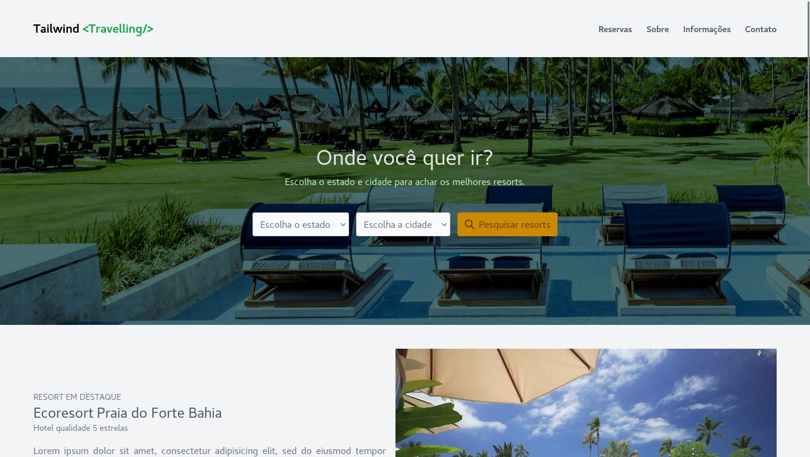

<h1 align="center"> Tailwind Travelling </h1>

  <a href="#-tecnologias">Tecnologias</a>&nbsp;&nbsp;&nbsp;|&nbsp;&nbsp;&nbsp;
  <a href="#-projeto">Projeto</a>&nbsp;&nbsp;&nbsp;|&nbsp;&nbsp;&nbsp;
  <a href="#gear-funcionamento">Funcionamento</a>

  

 

  

## 🚀 Tecnologias

Esse projeto foi desenvolvido com as seguintes tecnologias:

- HTML
- Tailwind CSS

## 💻 Projeto

Site de agência de viagens

## :gear: Funcionamento

Para que o projeto funcione é necessário ter um navegador que suporte as versões recentes do Tailwindcss. Vale lembrar que para o projeto eu utilizei o Tailwind na versão 3.2.7.

---
